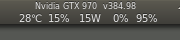

# GPU Status
A simple python script to watch the GPU churn away at your numbers. It's useful for optimizing data preparation that is passed to your machine learning models. 

# Requirements
It was written long ago in Python 2.7, then 3.0, but is atleast compatible to 3.7

Gtk 3.0

Thread module 

subprocess module

cairo

#### Figure of status bar in action

This is an older script that leaves some room for improvements. It places what is an icon that appears dynamic and animated on your  Ubuntu Top MenuBar. The icon updates every 100 milliseconds to display the current;

    GPU Model and installed driver 

        GPU temperature (Celsius)

        GPU processor utilization (%)

        power consumption (Watts)

        used memory (%)
    
        available memory (%)
      
      

Also, the script controls the fan that you might want to adjust to your own likings, but I found the settings here to allow quiet operation in most normal GPU operations (gaming, movie watching, graphics work, etc..), but cranks up like a Harley when training on a new dataset. 
    
